# ShotSight 2.0 High-Level Design

## 1. Document Control

| Item | Value |
| --- | --- |
| Product | ShotSight 2.0 |
| Document | High-Level Design |
| Source requirements | `doc/proposal.md` |
| Language | English |
| Status | Architecture baseline |
| Application type | Local-first web application |
| Target platforms | macOS, Windows, Linux |
| Primary user | Single local user |

## 2. Purpose

This document defines the high-level architecture for ShotSight 2.0. It
translates the approved product requirements into system modules, module
responsibilities, relationships, runtime processes, data ownership, interfaces,
failure behavior, and deployment options.

The document deliberately separates confirmed architecture from implementation
details that must be decided through technical spikes. In particular, the
tracking backend remains replaceable because the official SAM 3.1 video
implementation, the Apple Silicon MLX image implementation, and CPU fallback
solutions have different capabilities.

## 3. Confirmed Architecture Decisions

The following decisions were confirmed for this design:

1. The first release uses FastAPI server-rendered pages.
2. The UI may be separated into a dedicated frontend application in a later
   release.
3. Video analysis runs in a separate local worker process.
4. Only one video analysis job runs at a time.
5. Apple Silicon uses MLX SAM 3 Image plus a lightweight temporal tracker as the
   preferred backend.
6. Windows/Linux systems with a supported NVIDIA GPU use official SAM 3.1 video
   tracking as the preferred backend.
7. Systems without a supported GPU use an OpenCV or lightweight-model backend.
8. All tracking implementations conform to a shared `TrackingBackend`
   interface.
9. Automatic calibration runs first. The user corrects calibration after the
   automatic analysis rather than blocking the analysis pipeline.
10. A failed analysis restarts from the beginning in the initial release.
11. Players receive automatic local identifiers and may be renamed by the user.
12. SQLite and filesystem access are isolated behind Repository interfaces.
13. English is the default interface language, with Chinese available through
    an immediate language switch.

## 4. Architectural Goals

The architecture shall:

- preserve all processing and media on the local computer;
- support 30-minute, 1 GB, up-to-4K source videos;
- operate across macOS, Windows, and Linux;
- support indoor, outdoor, half-court, full-court, single-player, and
  multiplayer footage;
- tolerate poor lighting, blur, occlusion, and camera changes;
- allow vision backends to vary by local hardware;
- preserve the original video and version all derived artifacts;
- support automated results followed by complete human correction;
- keep domain rules testable without loading an AI model;
- expose analysis progress and actionable failures;
- support later replacement of the server-rendered UI without rewriting domain
  or analysis logic.

## 5. System Context

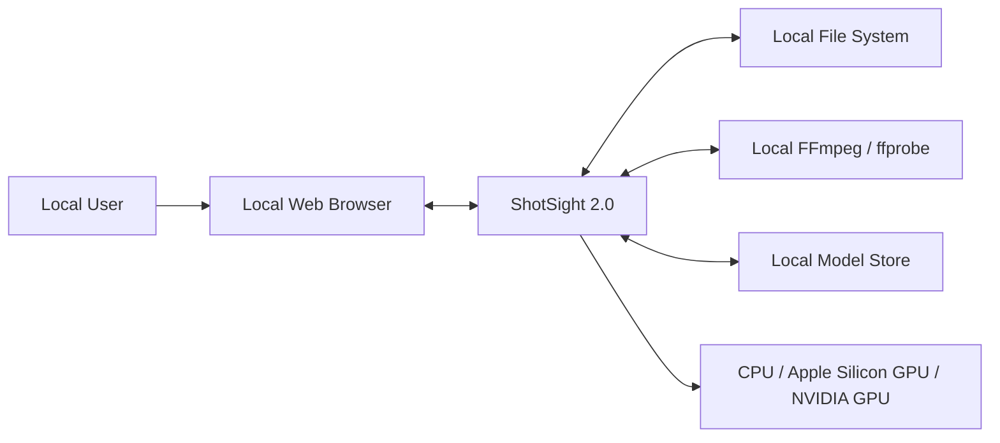

ShotSight does not require a cloud service, user account, remote database,
remote video storage, or paid GPU. Model downloads or access-token setup are
installation activities, not runtime dependencies of the core application.

## 6. Architecture Style

ShotSight uses a modular local application architecture with two runtime
processes:

- **Web process:** FastAPI application, server-rendered UI, local API, review
  commands, and job control.
- **Analysis worker:** one local background process that owns CPU/GPU-intensive
  media and vision processing.

Within each process, the design follows ports-and-adapters boundaries:

- **Presentation layer:** HTTP routes, pages, forms, localization, progress.
- **Application layer:** use cases and orchestration.
- **Domain layer:** model-independent basketball and review rules.
- **Ports:** repository, media, tracking, rendering, and job contracts.
- **Adapters:** SQLite, filesystem, FFmpeg, MLX SAM 3, official SAM 3.1, OpenCV,
  and process communication.

## 7. Logical Architecture

```mermaid
flowchart TB
    subgraph Presentation["Presentation Layer"]
        UI["Server-Rendered Web UI"]
        API["FastAPI Routes / Local API"]
        I18N["Localization"]
    end

    subgraph Application["Application Layer"]
        Library["Video Library Service"]
        Upload["Video Ingestion Service"]
        Jobs["Analysis Job Service"]
        CalibrationApp["Calibration Application Service"]
        Review["Review Service"]
        Query["Results Query Service"]
        Delete["Deletion Service"]
    end

    subgraph Worker["Analysis Worker"]
        Pipeline["Analysis Pipeline Orchestrator"]
        Media["Media Processing Service"]
        Segment["Camera Segment Service"]
        Calibration["Calibration Service"]
        Tracking["Tracking Service"]
        Association["Track Association Service"]
        ShotEngine["Shot Lifecycle Engine"]
        Court["Court Mapping Service"]
        Render["Artifact Rendering Service"]
        Stats["Statistics Service"]
    end

    subgraph Domain["Domain Layer"]
        Models["Domain Models"]
        Rules["Shot / Outcome / Review Rules"]
    end

    subgraph Ports["Ports"]
        RepoPort["Repository Interfaces"]
        MediaPort["Media Tool Interface"]
        TrackingPort["TrackingBackend"]
        QueuePort["Job Queue Interface"]
        ArtifactPort["Artifact Store Interface"]
    end

    subgraph Adapters["Infrastructure Adapters"]
        SQLite["SQLite Repositories"]
        FS["Filesystem Artifact Store"]
        FFmpeg["FFmpeg Adapter"]
        MLX["MLX SAM 3 Image Adapter"]
        CUDA["SAM 3.1 Video Adapter"]
        Fallback["OpenCV / Lightweight Adapter"]
        IPC["Local Worker Queue"]
    end

    UI --> API
    API --> Application
    Application --> Domain
    Application --> Ports
    Jobs --> QueuePort
    QueuePort --> IPC
    IPC --> Pipeline
    Pipeline --> Media
    Pipeline --> Segment
    Pipeline --> Calibration
    Pipeline --> Tracking
    Pipeline --> Association
    Pipeline --> ShotEngine
    Pipeline --> Court
    Pipeline --> Render
    Pipeline --> Stats
    Worker --> Domain
    Worker --> Ports
    RepoPort --> SQLite
    ArtifactPort --> FS
    MediaPort --> FFmpeg
    TrackingPort --> MLX
    TrackingPort --> CUDA
    TrackingPort --> Fallback
```

## 8. Module Decomposition

### 8.1 Presentation Module

#### Responsibilities

- Render the video library as the first screen.
- Accept uploads and display validation errors.
- Display job state and stage-level progress.
- Present automatic calibration and correction controls.
- Present players, attempts, replays, shot charts, and heatmaps.
- Support attempt creation, deletion, and correction.
- Support player renaming.
- Confirm destructive video deletion.
- Switch between English and Chinese.

#### Dependencies

- Application API only.
- Translation resources.
- Media streaming endpoints for local artifacts.

#### Exclusions

- No direct database access.
- No direct filesystem access.
- No computer-vision logic.

### 8.2 Application API Module

#### Responsibilities

- Define local HTTP routes and request/response schemas.
- Validate user commands at the application boundary.
- Invoke application services.
- Stream local media with safe path resolution.
- Translate domain/application errors into user-facing HTTP responses.
- Expose worker progress without exposing process internals.

#### Principal Route Groups

- `/api/videos`
- `/api/videos/{video_id}`
- `/api/videos/{video_id}/analysis`
- `/api/videos/{video_id}/calibrations`
- `/api/videos/{video_id}/players`
- `/api/videos/{video_id}/attempts`
- `/api/artifacts/{artifact_id}`
- `/api/jobs/{job_id}`
- `/api/preferences/language`
- `/health`
- `/ready`

### 8.3 Video Library Module

#### Responsibilities

- List uploaded videos and current analysis status.
- Load video summaries and artifact availability.
- Report local storage usage.
- Coordinate query models for dashboards.

#### Relationships

- Reads `Video`, `AnalysisRun`, `ShotAttempt`, and artifact metadata through
  repositories.
- Does not perform upload, analysis, review, or deletion itself.

### 8.4 Video Ingestion Module

#### Responsibilities

- Stream uploads to a temporary local file.
- Enforce the 1 GB upload limit.
- Invoke `ffprobe` to validate duration, resolution, codecs, and decodability.
- Enforce the 30-minute duration limit.
- Accept all formats decodable by the installed FFmpeg build.
- Atomically move a validated file into permanent original-media storage.
- Persist source metadata.
- Reject corrupt or unsupported files with a clear reason.

#### Relationships

- Uses `MediaTool`.
- Uses `VideoRepository`.
- Uses `ArtifactStore`.
- Produces a `Video` record in `READY` state.

### 8.5 Analysis Job Module

#### Responsibilities

- Enqueue analysis requests.
- Enforce single-job concurrency.
- Start and monitor the analysis worker.
- Persist stage, progress, timestamps, configuration, and errors.
- Allow a failed or completed video to be analyzed again.
- Restart failed analyses from the beginning.
- Prevent concurrent analysis of the same or different videos.

#### Initial Job States

```text
QUEUED
RUNNING
COMPLETED
FAILED
CANCELLED
```

#### Initial Analysis Stages

```text
VALIDATING
PREPROCESSING
SEGMENTING_CAMERA
AUTO_CALIBRATING
TRACKING
DETECTING_SHOTS
MAPPING_COURT
RENDERING_ARTIFACTS
COMPUTING_STATISTICS
FINALIZING
```

### 8.6 Worker Queue Module

#### Responsibilities

- Transfer job identifiers from the web process to the analysis worker.
- Ensure only one worker consumes jobs.
- Allow the web process to query worker liveness.
- Avoid sending large video frames through inter-process communication.

#### Initial Implementation Boundary

The queue is local and durable enough to recover job state after restart. The
high-level design permits either:

- a SQLite-backed job claim loop; or
- a local process queue plus SQLite as the source of truth.

No external broker such as Redis is required for the initial release.

### 8.7 Analysis Pipeline Orchestrator

#### Responsibilities

- Load immutable analysis configuration.
- Select a compatible tracking backend.
- Execute analysis stages in order.
- Persist progress after each stage.
- Create versioned artifacts under an analysis-run identifier.
- Clean partial temporary files on failure.
- Mark the entire run failed if any required stage fails.
- Restart from stage one when the user retries.

#### Pipeline

```mermaid
flowchart LR
    A["Validate Source"] --> B["Create Proxy"]
    B --> C["Detect Stable Camera Segments"]
    C --> D["Automatic Calibration"]
    D --> E["Detect and Track Players / Ball / Rim"]
    E --> F["Associate Possession and Shooter"]
    F --> G["Detect Shot Lifecycles"]
    G --> H["Classify Outcome"]
    H --> I["Map Shot Location"]
    I --> J["Render Replays and Tracking Video"]
    J --> K["Compute Statistics"]
    K --> L["Publish Analysis Run"]
```

### 8.8 Media Processing Module

#### Responsibilities

- Read metadata through `ffprobe`.
- Generate an analysis proxy through FFmpeg.
- Normalize orientation and variable frame rate.
- Downscale 4K sources when required.
- Apply a configurable frame-sampling policy.
- Extract stable calibration frames.
- Generate per-shot replay clips.
- Encode the annotated full-length video.

#### Performance Profiles

The module supports configuration-driven profiles such as:

- **Quality:** higher resolution and temporal density.
- **Balanced:** default compromise.
- **Speed:** aggressive downscaling and candidate-frame sampling.

Exact dimensions and frame rates remain technical-spike outputs and are not
fixed in this document.

### 8.9 Camera Segment Module

#### Responsibilities

- Detect setup motion and mid-video camera changes.
- Divide the timeline into stable and unstable ranges.
- Pause tracking and shot decisions during unstable ranges.
- Produce `CameraSegment` records.
- Reset calibration and tracking state at each stable-segment boundary.

#### Output

Each stable segment contains:

- start and end timestamps;
- stability confidence;
- representative frame;
- calibration reference;
- tracking-run reference.

### 8.10 Calibration Module

#### Responsibilities

- Attempt automatic rim and court calibration for every stable segment.
- Estimate calibration confidence.
- Persist the automatic calibration even when confidence is low.
- Allow the user to correct rim and NBA court points after analysis.
- Recompute location-dependent results after correction.
- Mark non-standard or insufficiently visible courts as indicative.

#### Confirmed Flow

Automatic analysis does not pause for calibration. If calibration is missing or
uncertain, the pipeline continues with an estimated or indicative coordinate
system. User correction later triggers recalculation of location, region, and
two-point/three-point classification.

### 8.11 Tracking Backend Selection Module

#### Responsibilities

- Detect operating system, chip architecture, available accelerators, memory,
  installed model files, and backend health.
- Rank compatible tracking backends.
- Select one backend for an analysis run.
- Record backend name, version, model, and configuration.
- Provide a clear fallback reason when the preferred backend is unavailable.

#### Selection Policy

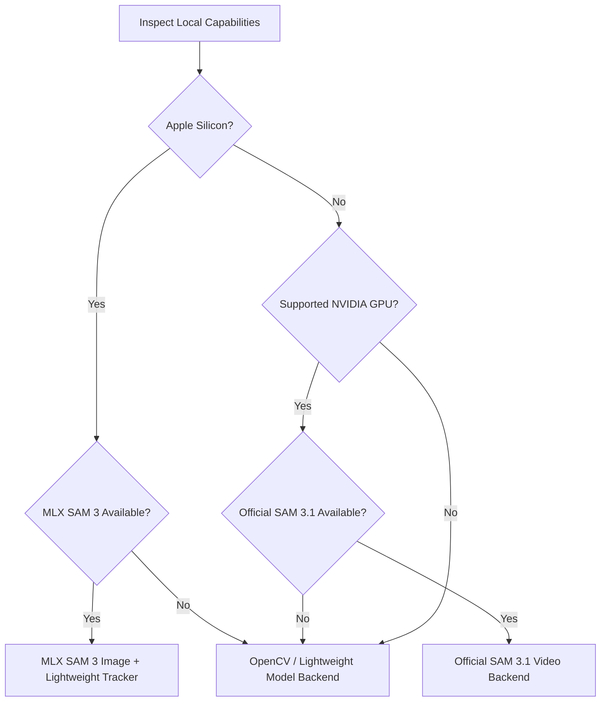

### 8.12 Tracking Module

#### Responsibilities

- Request basketball, player, and rim proposals.
- Maintain object tracks and confidence over time.
- Record visibility, occlusion, and track-loss events.
- Prevent implausible identity changes.
- Accept a user point/box prompt to repair ball tracking.
- Store track observations rather than embedding them only in rendered video.

#### Backend Implementations

##### Apple Silicon Backend

- MLX SAM 3 Image generates object proposals or masks on selected keyframes.
- A lightweight temporal tracker propagates objects between MLX detections.
- MLX is rerun after camera changes, confidence loss, or scheduled refresh.
- The temporal tracker may use optical flow, Kalman filtering, template
  similarity, motion constraints, or a measured combination.
- This backend does not claim that the image-only MLX port provides native video
  memory.

##### NVIDIA Backend

- Official SAM 3.1 video tracking supplies prompted temporal masks when the
  supported CUDA environment and model are available.
- ShotSight still owns track confidence, basketball physics constraints,
  lifecycle logic, and user corrections.

##### CPU / Unsupported GPU Backend

- OpenCV and/or a compact local model supplies proposals and tracks.
- The backend exposes the same outputs, with capability and quality limitations
  visible to the user.

### 8.13 Track Association Module

#### Responsibilities

- Maintain local player IDs within one video.
- Assign default names such as `Player 1`, `Player 2`.
- Permit user renaming without changing track identity.
- Associate ball possession with a player track.
- Identify the shooter at release.
- Avoid cross-video identity recognition.
- Flag uncertain shooter attribution for review.

### 8.14 Shot Lifecycle Engine

#### Responsibilities

- Determine possession before release.
- Detect ball release from a player.
- Count blocked attempts only after release.
- Count air balls.
- Reject shooting motions where the ball never leaves possession.
- Track immediate blocks, flight, rim approach, rim crossing, and terminal
  outcome.
- Produce confidence and evidence references for every decision.

#### Conceptual Lifecycle

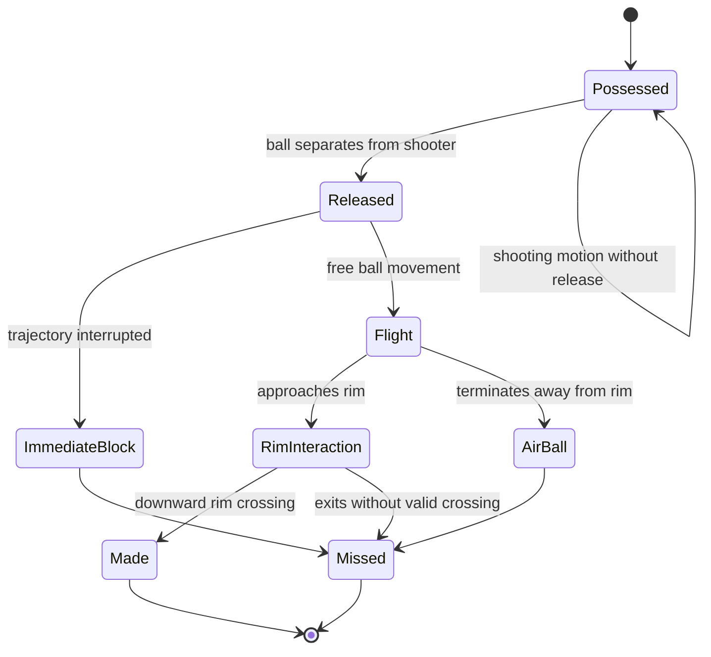

### 8.15 Outcome Classification Module

#### Responsibilities

- Classify a make only when the ball crosses downward through the rim region.
- Classify other completed attempts as misses when evidence is sufficient.
- Mark insufficient evidence as uncertain.
- Preserve automatic evidence and confidence after user override.
- Never rewrite the original automatic result when a review correction is
  applied.

### 8.16 Court Mapping Module

#### Responsibilities

- Estimate shooter release position in image coordinates.
- Apply segment-specific homography to NBA court coordinates.
- Store coordinates in meters.
- Determine named court region.
- Determine two-point or three-point classification.
- Generate indicative normalized coordinates when precise calibration is
  unavailable.
- Recompute results after calibration or location correction.

### 8.17 Artifact Rendering Module

#### Responsibilities

- Generate one replay around each attempt.
- Generate the full annotated tracking video.
- Render track masks, identifiers, confidence indicators, rim, event labels, and
  relevant trajectories.
- Generate shot-chart and heatmap data or renderings.
- Write artifacts atomically.
- Version artifact filenames by analysis run and rendering configuration.

### 8.18 Statistics Module

#### Responsibilities

- Calculate attempts, makes, misses, and shooting percentage.
- Calculate two-point and three-point breakdowns.
- Calculate player-level breakdowns.
- Calculate reviewed and unreviewed counts.
- Recalculate immediately after review changes.

Statistics are derived from the effective result: the latest valid user
correction overrides the automatic value without deleting it.

### 8.19 Review Module

#### Responsibilities

- Add or remove shot attempts.
- Edit shooter attribution.
- Rename players.
- Override make/miss result.
- Override shot type.
- Correct shot location.
- Record correction type, prior value, new value, and timestamp.
- Recalculate dependent statistics.
- Expose low-confidence events first.

### 8.20 Persistence Module

#### Responsibilities

- Implement repository contracts for metadata and domain records.
- Use SQLite as the initial database.
- Define transactional boundaries.
- Avoid leaking SQLite-specific row structures into application or domain code.
- Support future schema migrations.

#### Repository Families

- `VideoRepository`
- `AnalysisRunRepository`
- `CameraSegmentRepository`
- `CalibrationRepository`
- `PlayerTrackRepository`
- `BallTrackRepository`
- `ShotAttemptRepository`
- `ReviewCorrectionRepository`
- `ArtifactRepository`
- `JobRepository`

### 8.21 Artifact Store Module

#### Responsibilities

- Own local paths for originals, proxies, models, temporary files, replays,
  masks, tracked videos, and reports.
- Resolve stored logical identifiers into safe local paths.
- Prevent path traversal.
- Perform atomic writes and moves.
- Delete complete video-owned artifact trees.
- Report storage usage.

### 8.22 Deletion Module

#### Responsibilities

- Display a pre-deletion inventory.
- Confirm destructive deletion.
- Reject deletion while the video is actively being analyzed.
- Remove database records and filesystem artifacts.
- Handle partial filesystem deletion as a recoverable cleanup state.
- Preserve unrelated model files and other videos.

## 9. Module Relationship Matrix

| Module | Calls | Owns |
| --- | --- | --- |
| Presentation | Application API | UI state only |
| Application API | Application services | HTTP schemas |
| Video Ingestion | Media Tool, repositories, artifact store | Upload transaction |
| Analysis Job | Job repository, worker queue | Job lifecycle |
| Pipeline Orchestrator | Analysis services and repositories | Analysis-run workflow |
| Media Processing | FFmpeg adapter, artifact store | Proxy and clip operations |
| Camera Segment | Media frames | Stable timeline ranges |
| Calibration | tracking proposals, repositories | Segment calibration |
| Tracking | `TrackingBackend` | Track observations |
| Track Association | player and ball tracks | Possession and shooter links |
| Shot Engine | associated tracks, calibration | Automatic attempts |
| Court Mapping | calibration, shot release positions | Court coordinates |
| Rendering | tracks, attempts, media adapter | Derived visual artifacts |
| Review | repositories, statistics | User corrections |
| Persistence | SQLite | Structured local state |
| Artifact Store | Filesystem | Binary local state |

## 10. Key Runtime Flows

### 10.1 Upload Flow

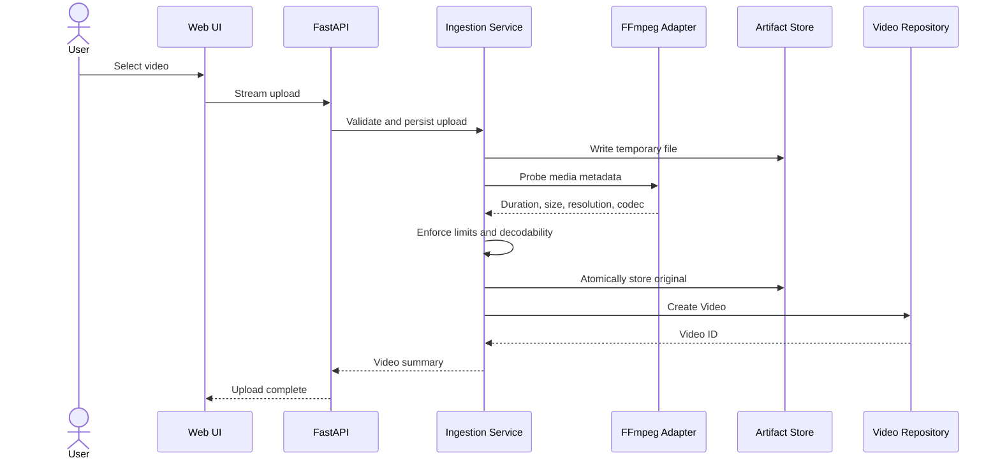

### 10.2 Analysis Flow

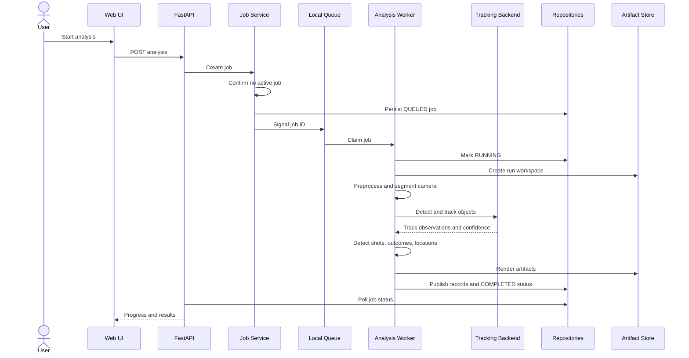

### 10.3 Post-Analysis Calibration Correction

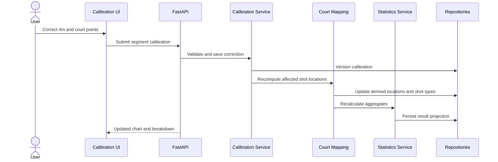

### 10.4 Manual Tracking Repair

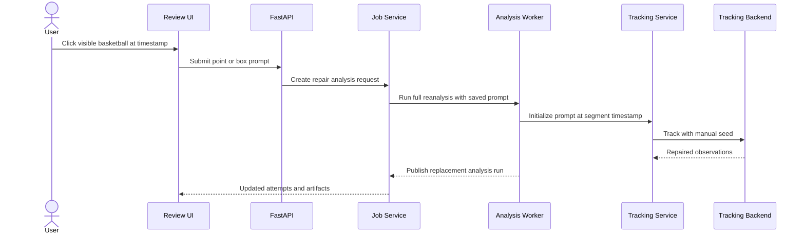

In the initial release, a repair request triggers full analysis from the
beginning, consistent with the confirmed failure-recovery policy.

### 10.5 Review Override Flow

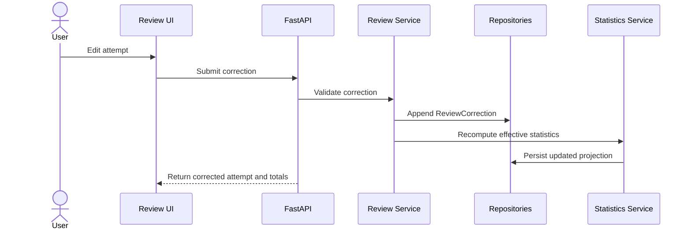

### 10.6 Video Deletion Flow

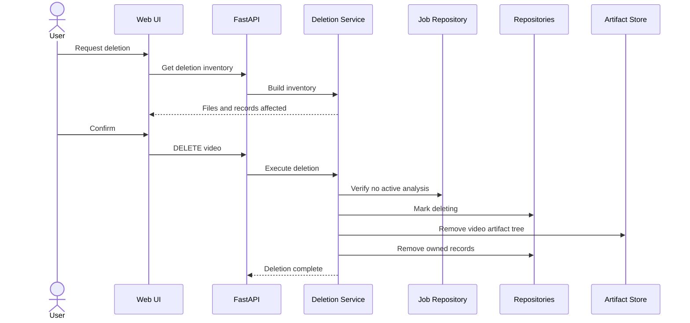

## 11. Tracking Backend Contract

The application layer depends on a capability-oriented interface rather than a
specific model package.

```python
class TrackingBackend(Protocol):
    def capabilities(self) -> BackendCapabilities: ...
    def load(self, model_config: ModelConfig) -> None: ...
    def start_segment(
        self,
        segment: CameraSegmentInput,
        prompts: list[TrackingPrompt],
    ) -> TrackingSession: ...
    def process_batch(
        self,
        session: TrackingSession,
        frames: FrameBatch,
    ) -> TrackingBatchResult: ...
    def add_prompt(
        self,
        session: TrackingSession,
        prompt: TrackingPrompt,
    ) -> None: ...
    def close_segment(self, session: TrackingSession) -> TrackingSummary: ...
    def unload(self) -> None: ...
```

### Required Backend Output

Each observation includes:

- analysis timestamp;
- object class;
- local track ID;
- bounding box;
- optional mask reference;
- centroid;
- confidence;
- visibility state;
- occlusion state;
- backend provenance;
- prompt or reinitialization reference.

### Backend Capability Flags

- text prompts;
- point prompts;
- box prompts;
- mask prompts;
- native video memory;
- multi-object tracking;
- supported device types;
- batch support;
- mask output;
- maximum recommended resolution.

## 12. Repository Contracts

Repositories expose domain-oriented operations and hide SQLite.

```python
class VideoRepository(Protocol):
    def create(self, video: Video) -> None: ...
    def get(self, video_id: VideoId) -> Video | None: ...
    def list(self) -> list[Video]: ...
    def mark_deleting(self, video_id: VideoId) -> None: ...
    def delete(self, video_id: VideoId) -> None: ...


class AnalysisRunRepository(Protocol):
    def create(self, run: AnalysisRun) -> None: ...
    def update_progress(self, run_id: RunId, progress: AnalysisProgress) -> None: ...
    def publish(self, run_id: RunId) -> None: ...
    def fail(self, run_id: RunId, error: AnalysisError) -> None: ...


class ShotAttemptRepository(Protocol):
    def replace_automatic_results(
        self,
        run_id: RunId,
        attempts: list[ShotAttempt],
    ) -> None: ...
    def list_effective(self, video_id: VideoId) -> list[EffectiveShotAttempt]: ...
```

Repository methods that publish a completed analysis use a transaction so users
never see a partially published result set.

## 13. Local API Overview

| Method | Path | Purpose |
| --- | --- | --- |
| `GET` | `/api/videos` | Video library |
| `POST` | `/api/videos` | Upload and validate video |
| `GET` | `/api/videos/{id}` | Video and latest analysis summary |
| `DELETE` | `/api/videos/{id}` | Delete video and owned data |
| `POST` | `/api/videos/{id}/analysis` | Queue full analysis |
| `GET` | `/api/jobs/{id}` | Analysis progress |
| `GET` | `/api/videos/{id}/segments` | Camera segments and calibration state |
| `PATCH` | `/api/videos/{id}/segments/{segment_id}/calibration` | Correct calibration |
| `GET` | `/api/videos/{id}/players` | Player tracks |
| `PATCH` | `/api/videos/{id}/players/{player_id}` | Rename player |
| `GET` | `/api/videos/{id}/attempts` | Effective attempts |
| `POST` | `/api/videos/{id}/attempts` | Add manual attempt |
| `PATCH` | `/api/videos/{id}/attempts/{attempt_id}` | Correct attempt |
| `DELETE` | `/api/videos/{id}/attempts/{attempt_id}` | Remove attempt |
| `POST` | `/api/videos/{id}/tracking/prompts` | Reserved; returns 409 until repair application is atomic |
| `GET` | `/api/artifacts/{artifact_id}` | Stream local artifact |
| `PUT` | `/api/preferences/language` | Change English/Chinese preference |
| `GET` | `/health` | Web-process liveness and local capability diagnostics |
| `GET` | `/ready` | Analysis readiness from database, queue, and worker heartbeat state |

These routes are local application boundaries. They do not imply public network
exposure or a cloud API.

## 14. Data Model Overview

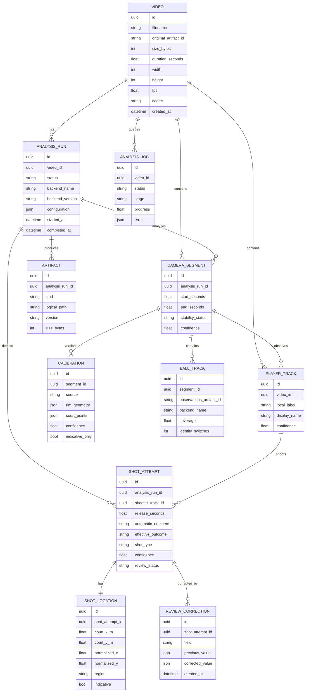

### 14.1 Effective Versus Automatic Values

Automatic results and human corrections remain separate:

- automatic values preserve reproducibility and model evaluation;
- corrections preserve user intent;
- effective values are projections used by UI and statistics;
- deleting a correction restores the automatic value.

### 14.2 Analysis Versioning

Every analysis run stores:

- application version;
- backend and model version;
- preprocessing profile;
- tracking configuration;
- calibration version;
- shot-engine configuration;
- rendering configuration.

## 15. Filesystem Layout

```text
data/
├── database/
│   └── shotsight2.db
├── uploads/
│   └── {video_id}/original.{ext}
├── artifacts/
│   └── {video_id}/
│       └── {analysis_run_id}/
│           ├── proxy/
│           ├── calibration/
│           ├── tracks/
│           ├── replays/
│           ├── rendered/
│           └── temporary/
└── models/
    ├── mlx/
    ├── sam3/
    └── fallback/
```

Database records store logical artifact identifiers. Only the artifact-store
adapter translates those identifiers into operating-system paths.

## 16. Deployment Architecture

### 16.1 Native Local Deployment

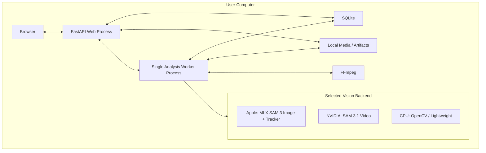

### 16.2 Optional Docker Deployment

Docker packages the core web and CPU-compatible worker behavior. GPU access is
platform-specific:

- NVIDIA Docker may expose CUDA on supported Linux/Windows environments.
- Apple MLX is not expected to run inside a standard Linux container on macOS.
- Native execution is the preferred Apple Silicon deployment.

Docker is optional and must not become the only supported installation method.

### 16.3 Process Communication

- Web and worker communicate through local job state and a lightweight signal.
- Large frames and masks are exchanged through files or memory-local worker
  processing, not serialized through HTTP.
- Both processes use repositories for durable state.
- SQLite write transactions are short to avoid blocking progress polling.

## 17. Failure and Recovery Design

### 17.1 Error Categories

| Category | Examples | User-visible behavior |
| --- | --- | --- |
| Upload | Size limit, duration limit, corrupt file | Reject upload with reason |
| Dependency | FFmpeg missing, model unavailable | Disable affected operation and show setup guidance |
| Capability | No compatible accelerated backend | Select fallback and show capability notice |
| Preprocessing | Codec failure, disk full | Mark run failed; preserve original |
| Tracking | Model crash, out of memory, lost object | Fail run or record low confidence according to severity |
| Calibration | Court invisible, invalid points | Continue as indicative and request correction |
| Persistence | SQLite transaction failure | Roll back publication and fail run |
| Rendering | Replay encode failure | Fail required artifact stage |
| Deletion | Locked file, permission error | Mark cleanup incomplete and list remaining files |

### 17.2 Retry Policy

- Automatic retries may be used for transient file access only.
- An analysis-stage failure marks the full run as failed.
- User retry creates a new analysis run from the beginning.
- A failed run remains available for diagnostics but is not the published result.
- Temporary artifacts from failed runs are cleaned safely.

### 17.3 Atomic Publication

The worker builds results under an unpublished analysis run. It publishes
structured results and promotes final artifacts only after all required stages
succeed. The previous completed run remains viewable until replacement
publication succeeds.

## 18. Security and Privacy Design

### 18.1 Network Boundary

- The default server binds to `127.0.0.1`.
- No remote access is enabled by default.
- No authentication is required while the service remains loopback-only.
- Any future LAN or internet exposure requires a separate authentication and
  transport-security design.

### 18.2 File Safety

- User filenames are display metadata, not storage paths.
- Storage paths use generated identifiers.
- Media streaming resolves only registered artifacts.
- Upload and extraction logic prevents path traversal.
- FFmpeg arguments are passed as structured subprocess arguments, not shell
  strings.

### 18.3 Data Privacy

- Video and derived imagery remain local.
- No analytics or telemetry are required.
- Model access tokens stay in local environment configuration and are ignored by
  Git.
- Deletion removes all video-owned data after confirmation.

## 19. Performance Design

### 19.1 One-Minute Target

Processing a 30-minute video in approximately one minute is an optimization
target. The architecture supports it through:

- adaptive resolution;
- candidate-frame sampling;
- keyframe MLX detection with lightweight inter-frame tracking;
- batching where supported;
- single-pass shared frame decoding;
- avoiding repeated full-resolution rendering;
- generating only required artifacts;
- backend-specific acceleration.

The architecture does not permit dropping short release or rim events solely to
meet the target.

### 19.2 Resource Controls

- Only one analysis runs at a time.
- Backend loading and unloading are explicit.
- Temporary storage is scoped to one run.
- Memory-intensive masks may be stored compactly or referenced as artifacts.
- Source 4K media is preserved but not necessarily decoded at full resolution
  for every stage.
- Disk-space checks occur before proxy and final-video generation.

### 19.3 Observability

Each run records:

- stage duration;
- frames decoded and analyzed;
- selected backend;
- source and proxy dimensions;
- inference batch size;
- tracking coverage;
- reinitialization count;
- identity-switch count;
- artifact rendering time;
- failure category.

## 20. Scalability and Extensibility

Although the first release is single-user and single-job, boundaries support:

- a future dedicated frontend consuming the same local API;
- additional tracking backends;
- additional court standards;
- export formats;
- user accounts;
- multiple workers or remote workers;
- native desktop packaging;
- model evaluation against stored automatic predictions.

The initial implementation shall not add distributed-system complexity before
those requirements exist.

## 21. Localization Design

- English is the default locale.
- Chinese is the secondary locale.
- Translation keys are stored outside route and domain logic.
- Domain enums use language-neutral values.
- Dates, numbers, percentages, and units are formatted in the presentation
  layer.
- User-entered player names are not translated.
- Generated video overlays use the selected rendering locale.

## 22. Testing Strategy

### 22.1 Unit Tests

- shot lifecycle transitions;
- make/miss rules;
- effective-value projection;
- court-region and two/three-point rules;
- player attribution rules;
- configuration and backend selection;
- repository behavior.

### 22.2 Contract Tests

- every `TrackingBackend`;
- every Repository implementation;
- FFmpeg adapter;
- artifact store;
- worker queue.

### 22.3 Integration Tests

- upload through database persistence;
- job creation and worker claim;
- successful analysis publication;
- failure and full restart;
- calibration correction and location recalculation;
- review override and statistics update;
- complete deletion.

### 22.4 Vision Evaluation

- benchmark ground-truth videos;
- ball detection precision/recall;
- track coverage and identity switches;
- shot-event precision/recall;
- make/miss accuracy;
- player attribution accuracy;
- two/three-point accuracy;
- calibrated location error;
- performance by hardware and quality profile.

### 22.5 Cross-Platform Validation

- macOS Apple Silicon native installation;
- Windows native installation;
- Linux native installation;
- optional Docker CPU installation;
- NVIDIA backend where supported;
- fallback behavior without model files or GPU.

## 23. Requirements Traceability Matrix

| Requirement | Primary modules |
| --- | --- |
| FR-1 Video Ingestion | Presentation, API, Video Ingestion, Media Tool, Artifact Store, Video Repository |
| FR-2 Video Preprocessing | Pipeline Orchestrator, Media Processing, FFmpeg Adapter |
| FR-3 Camera Stability and Segmentation | Camera Segment, Pipeline Orchestrator |
| FR-4 Calibration | Calibration, Court Mapping, Review, Presentation |
| FR-5 Basketball Detection and Tracking | Backend Selection, Tracking, `TrackingBackend`, Review |
| FR-6 Player Detection and Identity | Tracking, Track Association, Review |
| FR-7 Shot Attempt Definition | Track Association, Shot Lifecycle Engine |
| FR-8 Make/Miss Classification | Outcome Classification, Review |
| FR-9 Shot Location | Calibration, Court Mapping, Review |
| FR-10 Results | Statistics, Artifact Rendering, Results Query, Presentation |
| FR-11 Review and Correction | Review, Statistics, Repositories, Presentation |
| FR-12 Persistence and Deletion | Persistence, Artifact Store, Deletion |
| FR-13 Localization | Presentation, Localization |
| NFR-1 Performance | Media Processing, Tracking backends, Worker, Observability |
| NFR-2 Accuracy | Tracking, Shot Engine, Evaluation, Review |
| NFR-3 Portability | Backend Selection, Adapters, Packaging |
| NFR-4 Privacy | Local Deployment, Artifact Store, Security |
| NFR-5 Reliability | Job Service, Pipeline Orchestrator, Repositories |
| NFR-6 Maintainability | Layer boundaries, Ports, Tests |

## 24. Implementation Package Map

The source tree should evolve toward the following ownership:

```text
src/shotsight2/
├── presentation/
│   ├── routes/
│   ├── templates/
│   ├── static/
│   └── i18n/
├── application/
│   ├── commands/
│   ├── queries/
│   └── services/
├── domain/
│   ├── video/
│   ├── tracking/
│   ├── shots/
│   ├── court/
│   └── review/
├── ports/
│   ├── repositories.py
│   ├── tracking.py
│   ├── media.py
│   ├── artifacts.py
│   └── jobs.py
├── worker/
│   ├── process.py
│   ├── pipeline.py
│   └── stages/
├── adapters/
│   ├── persistence/
│   ├── filesystem/
│   ├── ffmpeg/
│   ├── tracking_mlx/
│   ├── tracking_sam3/
│   ├── tracking_fallback/
│   └── jobs/
├── config.py
└── main.py
```

The package map is a module ownership guide, not a requirement to create every
file before its behavior is implemented.

## 25. Technical Validation Gates

Before selecting a production tracking backend, Phase 1 must answer:

1. Can MLX SAM 3 Image reliably detect a small basketball on representative
   Apple Silicon footage?
2. Which lightweight tracker maintains ball identity between MLX keyframes?
3. How often must MLX re-detection run to recover from blur and occlusion?
4. Does official SAM 3.1 video tracking outperform the hybrid backend on
   supported NVIDIA hardware?
5. What quality is achievable on CPU-only systems?
6. Which proxy resolution and frame policy preserves release and rim events?
7. What automated accuracy thresholds are supported by benchmark evidence?
8. Which hardware profiles can approach the one-minute processing target?

Backend implementation proceeds only after these results are documented.

## 26. Known Constraints

- The MLX community model currently provides image inference rather than native
  SAM 3 video memory.
- Official SAM 3.1 video inference requires a compatible CUDA environment.
- CPU fallback quality may be lower.
- Automatic calibration may be inaccurate on non-standard or poorly visible
  courts.
- Automated 100% accuracy is not guaranteed; reviewed final results may reach
  100% through correction.
- Exact performance and backend support remain hardware-dependent.

## 27. Summary

ShotSight 2.0 is designed as a local, modular video-analysis system with a
server-rendered FastAPI web process and a separate single-job analysis worker.
The domain pipeline remains stable across platforms while hardware-specific
tracking adapters vary. Repositories isolate SQLite and filesystem details,
automatic analysis never blocks on calibration, and every automatic result can
be reviewed without losing its original evidence.

This design provides a direct architecture path from the approved product
proposal while preserving the technical validation required for SAM 3, MLX,
small-ball tracking, cross-platform operation, accuracy, and performance.
